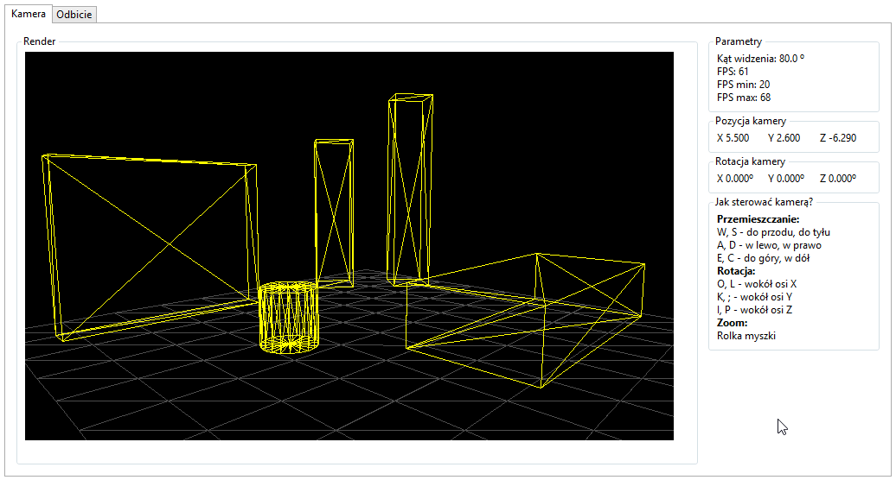
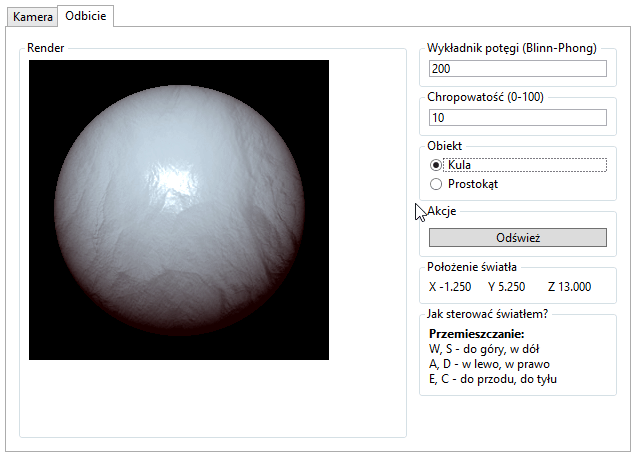
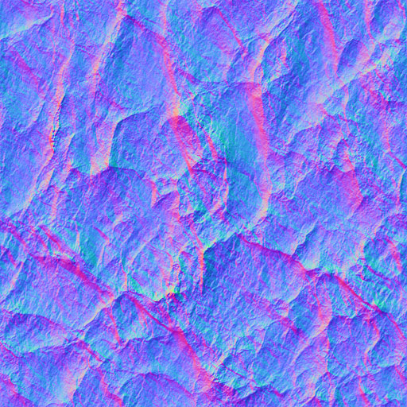

# graf3d

graf3d is simple 3D graphics rendering engine written in C#.
It implements:
* Line clipping algorithms (Liang-Barsky).
* Line rasterization algorithms (Bresenham, Recursive Midpoint).
* Specular reflection algorithms (Phong, Blinn-Phong).
* Bump mapping using normal maps.
* Translations, scaling and perspective.
* Rotations with quaternions.

Sample scene is imported from Unity exported JSON file.

# Projects structure
* `Engine/` - class library with no external dependencies implementing all graphics rendering.
* `Demo/` - WPF application rendering sample scene.

# Demos

### Zooming

### Camera movement

### Specular relflection

### Bump mapping

### Normal map used for bump mapping

